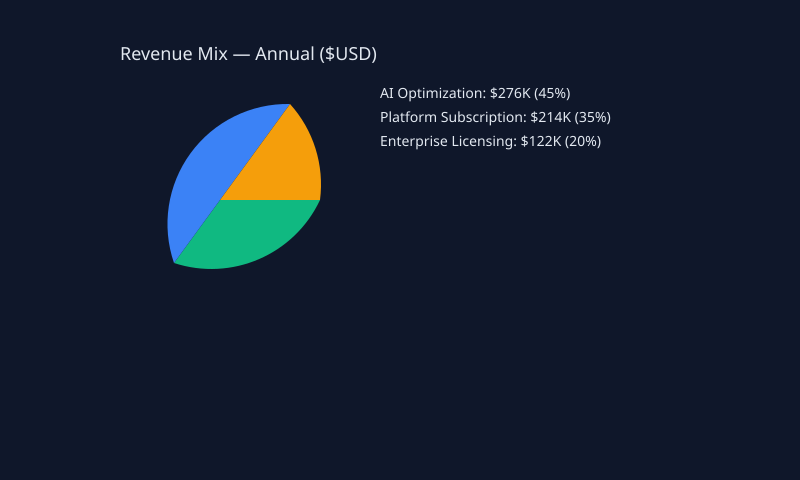
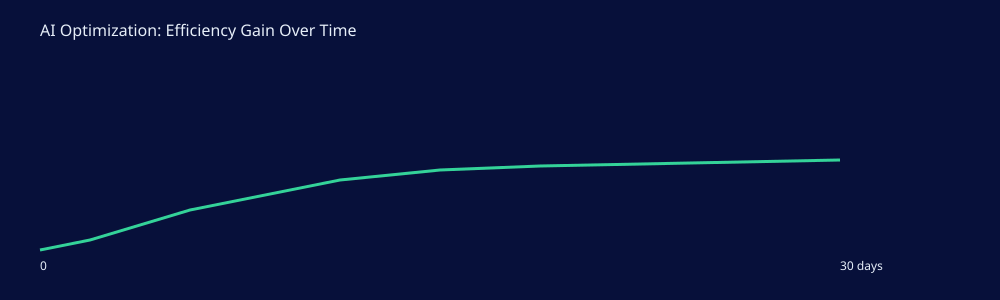
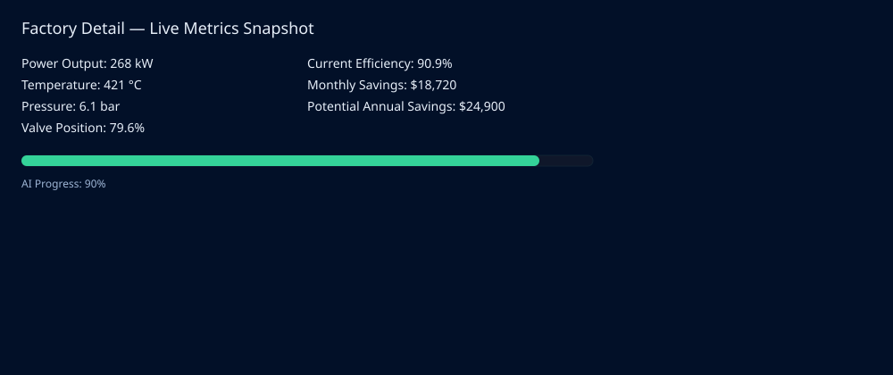

<p align="center">
  
  
  
  
  
  
</p>

<h1 align="center">⚡ ENTROPY ENGINE</h1>

<p align="center">
  <strong>AI-Powered Industrial Power Plant Optimization</strong><br/>
  <em>Physics-Informed Neural Network · Model Predictive Control · Real-Time Safety · Live 3D Visualization</em>
</p>

<p align="center">
  
  
</p>

---

## 📋 Table of Contents

- [Overview](#-overview)
- [Architecture](#-architecture)
- [Tech Stack](#-tech-stack)
- [Project Structure](#-project-structure)
- [Backend — Physics Simulation](#-backend--physics-simulation)
- [AI Pipeline — PINN + MPC](#-ai-pipeline--pinn--mpc)
- [Orchestrator — System Integration](#-orchestrator--system-integration)
- [Frontend — Dashboard + 3D](#-frontend--dashboard--3d)
- [API Reference](#-api-reference)
- [Safety System](#-safety-system)
- [Getting Started](#-getting-started)
- [Demo Flow](#-demo-flow)

---

## 🔥 Overview

**Entropy Engine** is a full-stack AI system that optimizes a simulated industrial power plant in real time. It uses a **Physics-Informed Neural Network (PINN)** trained with thermodynamic constraints and a **Model Predictive Controller (MPC)** to find optimal valve positions that maximize power output while enforcing hard safety limits.

### The Problem

Industrial power plants waste **15–30%** of potential energy output due to suboptimal manual control. Operators rely on conservative rule-based settings, leaving significant efficiency gains untapped.

### Our Solution

A closed-loop AI system that:

1. **Simulates** realistic plant physics (furnace → heat exchanger → steam drum → turbine)
2. **Learns** plant dynamics via a PINN that respects thermodynamic laws
3. **Optimizes** valve positions in real-time using Model Predictive Control
4. **Enforces** triple-layer safety constraints (training-time, decision-time, execution-time)
5. **Visualizes** everything in a live 3D dashboard with real-time charts

---

## 🏗 Architecture

```
┌─────────────────────────────────────────────────────────────────┐
│                        FRONTEND (:3000)                         │
│   React 19 + Three.js + Recharts + Framer Motion + Tailwind    │
│   ┌──────────┬────────────┬───────────┬──────────────────────┐  │
│   │ KPI Cards│ Live Charts│ AI Toggle │  3D Factory Scene    │  │
│   │ 4 metrics│ 4 streams  │ + Safety  │  Furnace·Pipe·Turbin │  │
│   └──────────┴────────────┴───────────┴──────────────────────┘  │
│                         ▲ polls /api/* every 1–3s               │
└─────────────────────────┼───────────────────────────────────────┘
                          │
┌─────────────────────────┼───────────────────────────────────────┐
│                   ORCHESTRATOR (:8001)                           │
│                    FastAPI + asyncio                             │
│   ┌────────────┬──────────────┬──────────────┬───────────────┐  │
│   │ AI Mode    │  Confidence  │   Safety     │   Structured  │  │
│   │ Manager    │  Monitor     │   Fallback   │   Logging     │  │
│   │ IDLE/ACT/  │  30-tick     │   Override   │   Per-tick    │  │
│   │ FALLBACK   │  rolling avg │   tracking   │   events      │  │
│   └────────────┴──────────────┴──────────────┴───────────────┘  │
│                         │ AI Bridge (lazy-loads MPC)             │
│                         ▼                                       │
│   ┌──────────────────────────────────────────────────────────┐  │
│   │              PINN + MPC Controller                       │  │
│   │   PyTorch model → 50 candidates → safety filter → best  │  │
│   └──────────────────────────────────────────────────────────┘  │
│                         │ GET /metrics, POST /control            │
└─────────────────────────┼───────────────────────────────────────┘
                          │
┌─────────────────────────┼───────────────────────────────────────┐
│                   SIMULATION ENGINE (:8000)                      │
│                    FastAPI + 1Hz physics loop                    │
│   ┌──────────┐    ┌───────────┐    ┌────────┐    ┌──────────┐  │
│   │ Furnace  │ →  │ Heat      │ →  │ Steam  │ →  │ Turbine  │  │
│   │ (source) │    │ Exchanger │    │ Drum   │    │Generator │  │
│   └──────────┘    └───────────┘    └────────┘    └──────────┘  │
│   Noise · Heat spikes · Valve inertia · Flow drift             │
└─────────────────────────────────────────────────────────────────┘
```

---

## 🛠 Tech Stack

### Backend (Person 1)

| Technology | Version | Purpose |
|:-----------|:--------|:--------|
| Python | 3.13 | Runtime |
| FastAPI | 0.115.0 | REST API framework |
| Uvicorn | 0.30.0 | ASGI server |
| Pydantic | 2.9.0 | Data validation |

### AI Pipeline (Person 2)

| Technology | Version | Purpose |
|:-----------|:--------|:--------|
| PyTorch | 2.10.0 | Neural network framework |
| NumPy | 2.4.2 | Numerical computation |
| Pandas | 3.0.1 | Data handling |
| scikit-learn | 1.8.0 | Preprocessing |
| httpx | 0.28.1 | Async HTTP client |

### Orchestrator (Person 3)

| Technology | Version | Purpose |
|:-----------|:--------|:--------|
| FastAPI | 0.115.0 | Orchestrator API |
| httpx | 0.28.1 | Backend communication |
| python-dotenv | 1.2.1 | Environment config |

### Frontend (Person 4)

| Technology | Version | Purpose |
|:-----------|:--------|:--------|
| React | 19.2.4 | UI framework |
| Vite | 7.3.1 | Build tool + HMR |
| Tailwind CSS | 4.2.0 | Utility-first styling |
| Three.js | 0.183.0 | 3D rendering engine |
| React Three Fiber | 9.5.0 | React ↔ Three.js bridge |
| @react-three/drei | 10.7.7 | 3D helpers (OrbitControls, Environment) |
| Recharts | 3.7.0 | Live data charts |
| Framer Motion | 12.34.3 | Animations & transitions |
| Axios | 1.13.5 | HTTP client |

---

## 📁 Project Structure

```
BankokHack/
│
├── backend/                           # Person 1 — Simulation Engine
│   ├── api.py                         # FastAPI app, 5 endpoints
│   ├── simulation_engine.py           # 1Hz physics loop
│   ├── models.py                      # Pydantic schemas
│   ├── config.py                      # Physics constants
│   └── requirements.txt
│
├── ai/                                # Person 2 — AI Pipeline
│   ├── model.py                       # PlantDynamicsModel (PINN architecture)
│   ├── pinn_loss.py                   # Physics-informed loss function
│   ├── mpc_controller.py              # Model Predictive Controller
│   ├── train.py                       # Training loop (200 epochs, early stop)
│   ├── data_collector.py              # Polls /metrics → CSV
│   ├── baseline_controller.py         # Rule-based heuristic controller
│   ├── control_loop.py                # Main AI control loop
│   ├── safety.py                      # Hard safety overrides
│   ├── config.py                      # AI hyperparameters
│   ├── utils.py                       # AIReport metrics class
│   ├── test_ai_integration.py         # End-to-end AI test
│   ├── ai/data/training_data.csv      # 1500 collected samples
│   └── ai/models/pinn_model.pt        # Trained model checkpoint
│
├── integrator/                        # Person 3 — System Integration
│   ├── orchestrator.py                # Main loop + 7 API endpoints
│   ├── ai_bridge.py                   # MPC lazy loader + heuristic fallback
│   ├── safety.py                      # Safety fallback with override tracking
│   ├── confidence.py                  # Rolling confidence monitor
│   ├── logger.py                      # Structured per-tick logging
│   ├── config.py                      # Env-driven configuration (superset)
│   └── requirements.txt
│
├── frontend/                          # Person 4 — Dashboard + 3D
│   ├── index.html
│   ├── vite.config.js                 # Vite + proxy to :8001
│   ├── package.json
│   └── src/
│       ├── App.jsx                    # Hero landing + dashboard layout
│       ├── main.jsx                   # React entry point
│       ├── index.css                  # Tailwind + glassmorphism theme
│       ├── components/
│       │   ├── KPICard.jsx            # Animated metric card
│       │   ├── LiveChart.jsx          # Real-time Recharts line/area
│       │   ├── AIToggle.jsx           # AI on/off switch with glow
│       │   ├── SafetyIndicator.jsx    # Safety level badge
│       │   ├── ComparisonPanel.jsx    # Before vs After comparison
│       │   ├── BusinessMetrics.jsx    # Energy/CO₂/₹ impact
│       │   └── StatusBar.jsx          # Top bar with state pills
│       ├── three/
│       │   ├── FactoryScene.jsx       # Main 3D canvas scene
│       │   ├── Furnace.jsx            # Temperature-reactive furnace
│       │   ├── Turbine.jsx            # Power-driven spinning turbine
│       │   ├── Pipe.jsx               # Flow-animated pipes
│       │   ├── SteamParticles.jsx     # Particle system from chimney
│       │   └── Floor.jsx              # Industrial grid floor
│       ├── hooks/
│       │   └── useMetrics.js          # Polling hooks (state, history, comparison)
│       ├── services/
│       │   └── api.js                 # Axios client + endpoint functions
│       └── constants/
│           └── theme.js               # Design tokens
│
├── .env                               # Environment variables
├── .gitignore
└── docker-compose.yml
```

---

## ⚙ Backend — Physics Simulation

The simulation engine models a **4-stage industrial power plant** running at 1 tick/second.

### Plant Model

```
FURNACE → HEAT EXCHANGER → STEAM DRUM → TURBINE GENERATOR
```

### Governing Equations

| Equation | Formula | Description |
|:---------|:--------|:------------|
| Heat Decay | $\frac{dT}{dt} = -k(T - T_{amb})$ | Newton's law of cooling, $k = 0.02$, $T_{amb} = 25°C$ |
| Effective Flow | $F_{eff} = F_{base} \times \frac{V}{100}$ | Flow modulated by valve position |
| Pressure | $P = c_1 \times T \times F_{eff}$ | Ideal gas approximation, $c_1 = 0.004$ |
| Power Output | $W = \eta \times P \times F_{eff}$ | Turbine conversion, $\eta = 0.35$ |
| Inertia | $x_{t+1} = 0.85 \cdot x_t + 0.15 \cdot x_{calc}$ | Thermal/mechanical inertia smoothing |

### Operating Envelope

| Parameter | Min | Max | Unit | Initial |
|:----------|:----|:----|:-----|:--------|
| Temperature | 400 | 600 | °C | 500 |
| Pressure | 4.0 | 8.0 | bar | 6.0 |
| Flow Rate | 2.0 | 5.0 | kg/s | 3.0 |
| Power Output | 150 | 300 | kW | 200 |
| Valve Position | 0 | 100 | % | 50 |

### Realism Features

- **Sensor noise** — Uniform ±2% on all readings
- **Furnace heat spikes** — 2% probability per tick, +30°C magnitude
- **Valve inertia** — Gradual movement toward target (10%/tick response rate)
- **Flow drift** — Random walk ±0.05 kg/s per tick
- **State smoothing** — 85% previous + 15% calculated (thermal inertia)

---

## 🧠 AI Pipeline — PINN + MPC

### Data Collection

- `data_collector.py` polls `/metrics` endpoint, collecting plant state snapshots
- **1500 samples** stored in CSV with columns: temperature, pressure, flow_rate, valve_position, power_output

### Model Architecture

```
PlantDynamicsModel (PINN)
═══════════════════════════════════════════
Input Layer      :  5 features (T, P, F, V, W)
                    ↓
Hidden Layer 1   :  Linear(5 → 64) → ReLU → BatchNorm → Dropout(0.1)
                    ↓
Hidden Layer 2   :  Linear(64 → 64) → ReLU → BatchNorm → Dropout(0.1)
                    ↓
Hidden Layer 3   :  Linear(64 → 32) → ReLU
                    ↓
Output Layer     :  Linear(32 → 1) → predicted power (kW)
═══════════════════════════════════════════
```

- **Normalization**: Per-feature z-score (mean/std stored in checkpoint)
- **Optimizer**: Adam, lr = 0.001
- **Training**: 200 epochs, batch size 64, 80/20 train/val split, early stopping (patience 30)

### Physics-Informed Loss Function

The PINN loss enforces thermodynamic consistency during training:

$$\mathcal{L}_{total} = \underbrace{\lambda_d \cdot \text{MSE}(\hat{W}, W)}_{\text{Data fidelity}} + \underbrace{\lambda_p \cdot \frac{R^2_{physics}}{\sigma^2_W}}_{\text{Physics residual}} + \underbrace{\lambda_s \cdot S_{penalty}}_{\text{Safety penalty}}$$

| Term | Weight | Formula | Purpose |
|:-----|:-------|:--------|:--------|
| Data Loss | $\lambda_d = 1.0$ | $\text{MSE}(\hat{W}, W)$ | Match observed power output |
| Physics Residual | $\lambda_p = 0.1$ | $(\hat{W} - \eta \cdot c_1 \cdot T \cdot F_{eff}^2)^2$ | Respect thermodynamic equations |
| Safety Penalty | $\lambda_s = 0.5$ | $\text{mean}(\text{ReLU}(P - 7.5)^2)$ | Penalize unsafe pressure predictions |

> The physics residual ensures the model cannot learn spurious correlations that violate thermodynamics. The safety penalty bakes in pressure awareness at training time.

### Model Predictive Controller (MPC)

The MPC uses the trained PINN for single-step lookahead optimization:

```
Algorithm: find_optimal_valve(metrics)
═══════════════════════════════════════
1. Generate 50 candidate valves: linspace(V_current ± 15%)
2. For each candidate:
   a. Build feature vector [T, P, F, V_candidate, W_current]
   b. Predict next-step power: Ŵ = PINN(features)
   c. Estimate pressure: P_est = 0.004 × T × F × V/100
   d. If P_est > 7.5 bar → REJECT (safety filter)
3. Select candidate with highest predicted power
4. Anti-oscillation: clamp ΔV to ±5%/tick
5. Compute confidence: min(|Ŵ_best - W_current| / W_current, 1.0)
6. If confidence < 0.01 → flag fallback to heuristic
═══════════════════════════════════════
Output: { optimal_valve, predicted_power, confidence, safe, fallback }
```

### Heuristic Fallback Controller

When MPC confidence is too low or the model fails to load, a rule-based controller takes over:

| Condition | Action | Rationale |
|:----------|:-------|:----------|
| Pressure > 7.8 bar | Valve −8% | Emergency depressurization |
| Pressure > 7.5 bar | Valve −3% | Preventive pressure reduction |
| Temperature > 590°C | Valve −5% | Prevent thermal damage |
| Temperature 560–590°C | Valve +3% | Extract more power from heat |
| Temperature 520–560°C | Valve +1% | Gentle optimization |
| Temperature < 440°C | Valve −3% | Let heat build up |

---

## 🔌 Orchestrator — System Integration

The orchestrator is the **central nervous system** — it bridges AI, backend, and frontend through a single unified API.

### State Machine

```
                ┌──────────┐
                │   IDLE   │  ← Default (AI off, collecting baseline)
                └────┬─────┘
                     │ POST /api/ai/toggle { enable: true }
                     ▼
                ┌──────────┐
                │  ACTIVE  │  ← AI making real-time MPC decisions
                └────┬─────┘
                     │ AI crash / timeout / confidence < 0.3
                     ▼
                ┌──────────┐
                │ FALLBACK │  ← Safe valve = 50%, auto-recovery every 10 ticks
                └────┬─────┘
                     │ 10 consecutive good predictions → recovery
                     ▼
                   ACTIVE
```

### Tick Pipeline (1 Hz)

```
┌─────────────────────────────────────────────────────────────┐
│ 1. Fetch /metrics from simulation backend                   │
│ 2. Collect baseline power readings (when AI off)            │
│ 3. Get AI decision (MPC → heuristic → safe default)        │
│ 4. Apply safety constraints (override tracking)             │
│ 5. Anti-oscillation clamp (±5%/tick max change)             │
│ 6. Send POST /control to backend (only when AI active)      │
│ 7. Update confidence monitor (rolling 30-tick window)       │
│ 8. Auto-disable on low confidence / auto-recovery check     │
│ 9. Append to history (capped at 300 entries)                │
│ 10. Structured logging (tick, safety events, AI events)     │
└─────────────────────────────────────────────────────────────┘
```

### Confidence Monitor

Tracks AI prediction accuracy in real-time:

$$\text{confidence}_t = \max\left(0,\; 1 - \frac{|\hat{W}_t - W_t|}{\max(W_t, 1)}\right)$$

- **Window**: Rolling average over last 30 ticks
- **Auto-disable**: If $\bar{c}_{30} < 0.3$ → AI disabled, enters FALLBACK
- **Recovery**: 10 consecutive predictions with $c_t \geq 0.3$ → re-enable AI

---

## 🎨 Frontend — Dashboard + 3D

### Hero Landing Page

Full-screen 3D factory as background with gradient overlays, animated title, feature pills, and "Launch Dashboard →" CTA button. Shows live backend connection status.

---

## 📸 Screenshots & Demo Graphs

Below are representative screenshots and generated graphs from the dashboard and operator views used in the hackathon demo. These are included as simple SVG exports for the repository so reviewers can see key UX surfaces without starting the full stack.

- **Revenue Mix** — shows the annual revenue split used in the pitch (AI Optimization, Platform Subscription, Enterprise Licensing).
- **AI Efficiency Trend** — simulated curve showing gradual efficiency improvement as AI optimizations ramp.
- **Factory Detail Snapshot** — per-plant telemetry and AI progress as presented to operators.

### Embedded Images

<div>
  
</div>

<div>
  
</div>

<div>
  
</div>

If you'd like high-resolution PNG/JPEG exports instead, I can generate them or provide a short script to render the SVGs to PNG locally using `rsvg-convert` or Node.js tooling.


### Dashboard Layout

```
┌──────────────────────────────────────────────────────────────┐
│ StatusBar: AI Mode · Safety Level · Confidence · Tick · ●    │
├──────────┬──────────┬──────────┬─────────────────────────────┤
│ Power ⚡ │ Temp 🌡️  │ Press 💨 │ Valve 🔧                   │
│ 248.3 kW │ 512.3 °C │ 5.41 bar │ 58.0 %                     │
├──────────┴──────────┴──────────┴─────────────────────────────┤
│                                          │ AI Toggle [ON]    │
│       3D Factory Visualization           │ Safety: 🟢 NORMAL │
│       Furnace → Pipes → Turbine          │ Confidence: ██ 92%│
│                                          │                   │
├──────────────────────┬───────────────────────────────────────┤
│ Power Output Chart   │ Temperature Chart                     │
│ ── actual + predicted│ ── live area chart                    │
├──────────────────────┼───────────────────────────────────────┤
│ Pressure Chart       │ Valve Position Chart                  │
│ ── live area         │ ── current + AI recommended           │
├──────────────────────┴───────────────────────────────────────┤
│ ⚡ AI Impact Analysis                                        │
│ Baseline: 198 kW  →  AI: 252 kW  (+27.3%)                   │
├──────────────────────────────────────────────────────────────┤
│ 💼 Business Impact                                           │
│ ⚡ 54 kWh/hr  🌱 22 kg/hr  💰 ₹93,312/mo  📈 ₹11.3L/yr     │
└──────────────────────────────────────────────────────────────┘
```

### 3D Factory Scene — Data-Driven Reactions

| Plant Event | 3D Visual Effect |
|:------------|:-----------------|
| Temperature ↑ | Furnace glow intensifies (orange → red-white), emissive pulsing |
| Valve opens | Pipe flow dots speed up, more steam particles emitted |
| Power ↑ | Turbine blades spin faster |
| Pressure > 7.5 bar | Pipes turn red |
| AI activates | Turbine ring + blades glow blue, pulsing blue point light |
| AI off | Turbine is grey, no glow |

### Design System

- **Background**: Deep navy `#0a0e1a` with subtle grid pattern
- **Cards**: Glassmorphism — `backdrop-blur-xl`, gradient borders, subtle shadows
- **Typography**: Inter (UI) + JetBrains Mono (numbers)
- **Colors**: Blue primary, orange/amber warnings, emerald success, red danger
- **Effects**: Neon glow shadows, spring animations, animated transitions

---

## 📡 API Reference

### Simulation Engine (`:8000`)

| Method | Endpoint | Request | Response |
|:-------|:---------|:--------|:---------|
| `GET` | `/metrics` | — | `{ temperature, pressure, flow_rate, valve_position, power_output, timestamp }` |
| `POST` | `/control` | `{ valve_position: float }` | `{ status, target_valve_position }` |
| `GET` | `/status` | — | `{ status, uptime_seconds, tick_count, ai_mode }` |
| `POST` | `/ai-mode` | `?enabled=bool` | `{ ai_mode }` |
| `GET` | `/health` | — | `{ status: "ok" }` |

### Orchestrator (`:8001`)

| Method | Endpoint | Request | Response |
|:-------|:---------|:--------|:---------|
| `GET` | `/api/state` | — | Unified snapshot: metrics, ai_decision, ai_mode, safety_level, confidence report, uptime |
| `POST` | `/api/ai/toggle` | `{ enable: bool }` | `{ ai_mode, state }` |
| `GET` | `/api/ai/status` | — | Mode, confidence report, ai_loaded, load_error, total_decisions |
| `GET` | `/api/history` | `?limit=60` | Array of decision records (tick, metrics, AI valve, predicted power, confidence, safety) |
| `GET` | `/api/comparison` | — | `{ baseline_avg_power, ai_avg_power, improvement_pct, sample counts }` |
| `GET` | `/api/safety` | — | Safety status, color, headroom, override stats |
| `GET` | `/api/health` | — | `{ orchestrator, ai_loaded, backend_connected, uptime }` |

---

## 🛡 Safety System

Safety is enforced at **three independent layers** — no single failure can bypass protection:

### Layer 1: Training-Time (PINN Loss)

The neural network is trained with a safety penalty that penalizes predictions involving unsafe pressure:

$$S = \lambda_s \cdot \text{mean}\left(\text{ReLU}(P - 7.5)^2\right), \quad \lambda_s = 0.5$$

### Layer 2: Decision-Time (MPC Candidate Rejection)

During optimization, the MPC rejects any candidate valve position that would produce estimated pressure > 7.5 bar before it's even considered.

### Layer 3: Execution-Time (Hard Override)

After the AI makes a decision, hard safety rules override if needed:

| Priority | Condition | Action | Level |
|:---------|:----------|:-------|:------|
| 🔴 1 | Pressure > 7.8 bar | Force valve −10% | CRITICAL |
| 🟡 2 | Pressure > 7.5 bar | Block any valve increase | WARNING |
| 🟡 3 | Temperature > 590°C | Reduce valve by 5% | WARNING |
| 🟢 4 | All normal | AI decision passes through | NORMAL |

Additional safeguards:
- **Anti-oscillation**: Valve change clamped to ±5% per tick at every layer
- **Backend down**: After 5 consecutive fetch errors → enter FALLBACK mode
- **Low confidence**: Rolling 30-tick average < 0.3 → auto-disable AI
- **Model crash**: Exception caught → immediate FALLBACK + safe valve (50%)

---

## 🚀 Getting Started

### Prerequisites

- Python 3.13+
- Node.js 20+
- npm 9+

### 1. Clone

```bash
git clone https://github.com/raghavvag/Entropy_Engine.git
cd Entropy_Engine
```

### 2. Backend (Terminal 1)

```bash
cd backend
python -m venv venv
venv\Scripts\activate        # Windows
pip install -r requirements.txt
python -m uvicorn api:app --host 0.0.0.0 --port 8000
```

### 3. Orchestrator (Terminal 2)

```bash
cd integrator
python -m venv venv
venv\Scripts\activate
pip install -r requirements.txt
python -m uvicorn orchestrator:app --host 0.0.0.0 --port 8001
```

### 4. Frontend (Terminal 3)

```bash
cd frontend
npm install
npx vite --port 3000
```

### 5. Open

Navigate to **http://localhost:3000** — you'll see the hero landing page. Click **"Launch Dashboard →"** to enter the live control dashboard.

---

## 🎬 Demo Flow

| Time | Action | What Happens |
|:-----|:-------|:-------------|
| 0:00 | Page loads | Hero landing with 3D factory background, connection indicator turns green |
| 0:15 | Click "Launch Dashboard" | Dashboard appears — KPIs streaming, charts live, 3D scene rendering |
| 0:30 | Observe baseline | AI off, power ~150 kW, turbine grey, steady baseline readings |
| 1:00 | **Click AI Toggle → ON** | Toggle glows blue, status bar shows "ACTIVE", MPC loads |
| 1:30 | AI takes effect | Valve adjusts, turbine blades glow blue and spin faster |
| 2:30 | Peak performance | Power climbs, comparison panel shows improvement %, business metrics appear |
| 3:30 | Safety demo | If pressure approaches 7.5, safety indicator turns yellow, overrides shown |
| 4:30 | Results | Before vs After panel: baseline → AI optimized with % improvement |
| 5:00 | Close | Business impact: energy saved, CO₂ reduced, ₹ monthly savings |

---

## 👥 Team

| Role | Scope | Key Deliverables |
|:-----|:------|:-----------------|
| Person 1 | Simulation Engine | Physics loop, 5 REST endpoints, Pydantic models |
| Person 2 | AI Pipeline | PINN model, MPC controller, training, safety, data collection |
| Person 3 | System Integration | Orchestrator, state machine, confidence monitor, safety fallback, logging |
| Person 4 | Frontend + 3D | React dashboard, 3D factory, live charts, hero landing, glassmorphism UI |

---

<p align="center">
  <strong>Entropy Engine</strong> — Where Physics Meets Intelligence<br/>
  <em>Built with ❤️ for Bangkok Hack 2026</em>
</p>
